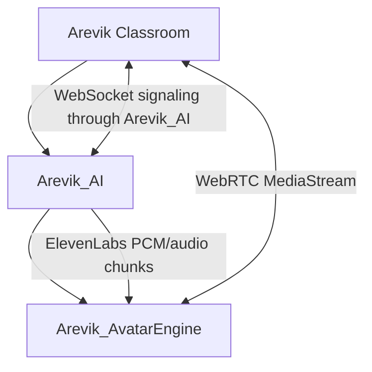

# Arevik AvatarEngine

Production avatar runtime for Arevik, based on `warmshao/FasterLivePortrait`.

This repository replaces the deprecated LiveTalk avatar pipeline. It is designed for a dedicated RunPod GPU Pod and exposes a stable AvatarEngine API consumed only by `Arevik_AI`.

## Upstream inspection

Upstream inspected: [warmshao/FasterLivePortrait](https://github.com/warmshao/FasterLivePortrait).

Observed capabilities:

- TensorRT inference path via `configs/trt_infer.yaml`
- ONNX inference path via `configs/onnx_infer.yaml`
- Docker/API deployment path
- automatic checkpoint download/conversion in upstream `api.py`
- MediaPipe support through `--mp` / `trt_mp_infer.yaml`
- InsightFace-based human face analysis in default human config
- webcam realtime mode via OpenCV windows
- JoyVASA audio-driven support in upstream WebUI
- frame-level pipeline APIs: `prepare_source`, `run`, and `run_with_pkl`

Missing from upstream and implemented here as wrappers:

- browser WebRTC signaling
- server-side `aiortc` `RTCPeerConnection`
- `VideoStreamTrack`
- STUN/TURN configuration hooks
- browser-safe session lifecycle API
- Arevik-compatible `/avatar/*` contract
- production health/metrics endpoints
- no-MP4 runtime path

Important limitation:

FasterLivePortrait exposes realtime webcam and audio-driven demos, but not a ready-made browser WebRTC server. This repo provides the WebRTC transport and session infrastructure. The engine adapter is isolated in `avatar_engine/faster_liveportrait_adapter.py` so deeper JoyVASA/audio-motion integration can be completed without changing Arevik or Arevik_AI APIs.

## API

- `GET /health`
- `GET /metrics`
- `POST /avatar/session/start`
- `POST /avatar/session/stop`
- `POST /avatar/audio`
- `WS /avatar/signaling/{session_id}`

WebSocket is used only for:

- SDP offer/answer
- ICE candidates
- heartbeat/session events

Avatar media is transported through WebRTC `MediaStream`.

## Environment variables

- `AVATAR_ENGINE_API_KEY`
- `AVATAR_IMAGE_URL`
- `FASTERLIVEPORTRAIT_ROOT=/opt/FasterLivePortrait`
- `CHECKPOINT_DIR=/models/FasterLivePortrait/checkpoints`
- `AVATAR_ENGINE_MODE=trt`
- `AVATAR_ENGINE_FORCE_TRT_REBUILD=false`
- `AVATAR_ENGINE_USE_MEDIAPIPE=true`
- `AVATAR_ENGINE_CFG=/opt/FasterLivePortrait/configs/trt_mp_infer.yaml`
- `TURN_URL`
- `TURN_USERNAME`
- `TURN_PASSWORD`
- `STUN_URL=stun:stun.l.google.com:19302`
- `HOST=0.0.0.0`
- `PORT=8000`

## Docker build

```bash
docker build -t arevik-avatar-engine:latest .
```

## First startup model preparation

The container prepares FasterLivePortrait automatically before starting the API.

Cold start:

1. Creates the persistent checkpoint directory at `CHECKPOINT_DIR`.
2. Links it to `/opt/FasterLivePortrait/checkpoints`, which is the path expected by upstream FasterLivePortrait configs and TensorRT scripts.
3. Downloads missing FasterLivePortrait checkpoints from Hugging Face.
4. Builds the human and animal TensorRT engines with upstream `scripts/all_onnx2trt.sh` and `scripts/all_onnx2trt_animal.sh`.
5. Verifies every required `.trt` engine exists before the API starts.

The image is based on NVIDIA's TensorRT Python container and installs the upstream FasterLivePortrait Python requirements. Startup fails with an explicit error if TensorRT is unavailable.
Checkpoint downloads use the modern Hugging Face `hf download` command installed at image build time; startup does not run `pip install` and does not call the deprecated `huggingface-cli` wrapper.

Warm start:

- Reuses existing checkpoints and TensorRT engines from the persistent volume.
- Skips TensorRT rebuild when all required engines already exist.

Set `AVATAR_ENGINE_FORCE_TRT_REBUILD=true` only when you intentionally need to regenerate the cached engines.

## RunPod Pod

```bash
docker run --gpus=all -p 8000:8000 \
  -v arevik-avatar-models:/models/FasterLivePortrait \
  -e AVATAR_ENGINE_API_KEY=... \
  -e AVATAR_IMAGE_URL=https://... \
  -e STUN_URL=stun:stun.l.google.com:19302 \
  arevik-avatar-engine:latest
```

Configure `Arevik_AI`:

```bash
AVATAR_ENGINE_ENDPOINT=https://<pod-host>
AVATAR_ENGINE_API_KEY=<same token>
AVATAR_ENGINE_HEALTH_ENDPOINT=https://<pod-host>/health
AVATAR_IMAGE_URL=https://...
STUN_URL=stun:stun.l.google.com:19302
TURN_URL=turn:...
TURN_USERNAME=...
TURN_PASSWORD=...
```

## Architecture



No runtime dependency remains on `Arevik_Avatar`, `Arevik_LiveTalk`, EchoMimic, or generated MP4 avatar videos.
